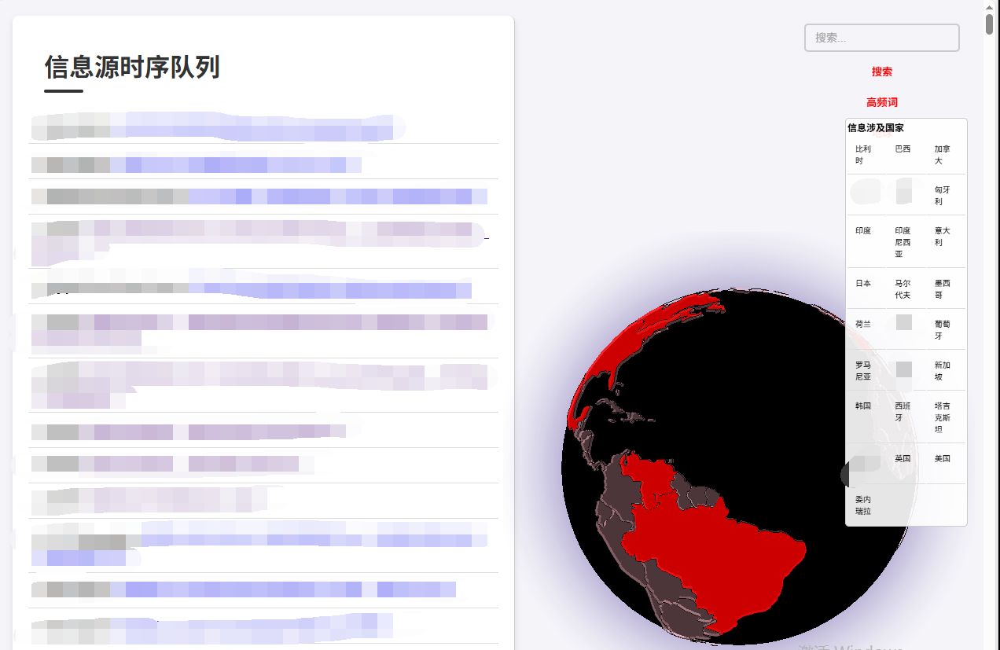
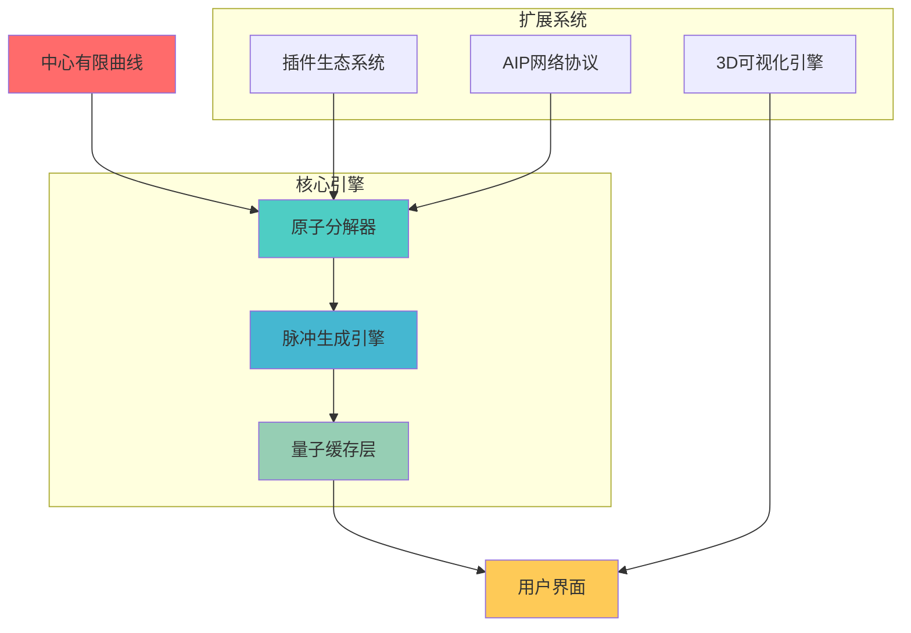

# ⚛️ AIP - Atomic Information Pulse

  

<div  align="center">

  


  

**⚡ 原子信息流聚合系统** | **Atomic Information Pulse**

  

[](https://python.org)

[](https://flask.palletsprojects.com)

[](https://redis.io)

[](LICENSE)

  

</div>

  

---

  

## 🌟 项目愿景

  

**AIP (Atomic Information Pulse)** 翻译过来就是“原子信息流”。这是一个**分钟级显示世界上正在发生的事**的程序。

  

这个系统能实时显示哪些信息，取决于您在项目根目录的**rss_sources.json**里配置了哪些数据源。系统会以一个快速且温和的频率来收集这些源的信息，并保证把数据映射到前端。

我们知道，世界上很多大事都是以国家为单位的，所以，我在前端做了一个“地球”的模型，当收集的信息中有某个国家时，这个国家就会高亮显示————这个地球可以转动哦，像一个**地球仪**。


**有限曲线设想**。

  

> *"设计这个系统的时候产生了一个小巧思，我们允许**每个人的系统之间可以互相分享信息**。互相弥补信息源的不足，最终能获取全球的信息。我们仿佛身处在有限曲线当中，每个人都可以是曲线中的一个原子"*

  

## ⚡ 核心哲学

  

### 🔬 原子化原理

-  **信息原子**：每个信息单元都是不可再分的最小单位

-  **脉冲频率**：信息以毫秒级频率更新，形成连续的信息脉冲

-  **量子叠加**：多个信息源叠加产生更丰富的信息态

  

### �� 信息流动力学

-  **湍流处理**：智能处理信息流中的噪声和干扰

-  **共振效应**：相关信息的自动聚合和增强

-  **熵减机制**：从混乱中提取有序的信息模式

  

## 🚀 技术特性

  

### ⚛️ 原子级处理引擎

-  **信息分解器**：将复杂信息分解为原子级单元

-  **脉冲生成器**：实时生成信息脉冲

-  **量子缓存**：基于概率的智能缓存系统

-  **时空压缩**：高效的信息存储和传输

  

### 🌐 多维信息网络

-  **RSS原子化**：标准RSS源的原子级处理

-  **API量子隧道**：无缝API接口连接

-  **插件生态系统**：可扩展的原子处理插件

-  **AIP网络协议**：分布式AIP实例通信

  

### 🎯 智能信息处理

-  **异步粒子加速**：多线程并行处理

-  **智能缓存矩阵**：Redis缓存系统

-  **3D信息可视化**：地球级信息分布展示

-  **语义搜索引擎**：基于AI的智能搜索

  

### 🎨 极致用户体验

-  **响应式界面**：完美适配所有设备

-  **实时脉冲显示**：信息流的实时可视化

-  **可拖拽原子**：自定义界面布局

-  **一键部署**：开箱即用的部署方案

  

## 🛠️ 技术架构

  



  

## 🚀 快速开始

  

### 📦 安装依赖

```bash

# 安装Python依赖，当然，如果你是windows，可以运行install.bat

pip  install  -r  requirements.txt

  

# 如果遇到pywebview安装问题，请查看 INSTALL.md

```

  

### ⚡ 一键启动

```bash

# Windows用户 - 启动原子加速器

start.bat

  

# Linux/Mac用户 - 启动脉冲引擎

chmod  +x  start.sh && ./start.sh

```

  

### 🌐 访问界面

-  **Web界面**：`http://localhost:5000`

-  **桌面应用**：自动启动WebView窗口

-  **移动端**：响应式设计，完美适配

  

## 📊 项目结构

  

```

AIP/

⚛️ 核心引擎

app.py # Flask后端服务

ui.py # 桌面客户端

scheduler.py # 定时任务调度器

🎨 前端界面

templates/ # HTML模板

static/ # 静态资源

components/ # UI组件

🔌 插件系统

plugins/ # 自定义插件

hot_api.py # 热搜API插件

aip_crawler.py # AIP网络爬虫

💾 数据存储

redis/ # Redis服务器

data/ # 数据文件

📚 文档资源

README.md # 项目说明

docs/ # 详细文档

```

  

## 🔧 配置指南

  

### 信息源配置

在 `rss_sources.json` 中配置你的信息源：这里的**type**，系统内置了rss、api和aip_crawler三种。

**用户可以在json写新的type名，然后在项目plugins里编写与type同名的插件模块，模块只要有run函数并且返回的格式满足标准（具体标准请往后看），系统就可以调用。**

如果你的源是一个rss地址，直接新增一条json，在对应的url写上rss地址，然后在type写上rss就行了。
内置的type  “**api**”，是根据许多免费api提供商（比如很多免费的热搜的api）提供的格式编写的，如果发现无法解析，请自行开发新type的插件模块（也可以联系作者）。
内置的aip_crawler是一个有趣的尝试：当别人也部署了Aip系统，我们可以把type写成aip_crawler，这样就能实时抓取别人的Aip的数据，就不需要自己去四处找信息源了。

  

```json

{

"sources": {

"news_api": {

"name": "新闻聚合",

"url": "https://api.example.com/news",

"type": "api"

},

"rss_feed": {

"name": "RSS源",

"url": "https://example.com/rss",

"type": "rss"

},

"aip_instance": {

"name": "AIP实例",

"url": "http://another-aip.com:5000",

"type": "aip_crawler"

}

}

}

```

  

### 插件开发

创建自定义插件来扩展AIP的功能：

  

```python

def  run(feed_url):

"""

AIP插件开发模板

返回标准格式的数据列表

"""

import requests

# 获取数据

response = requests.get(feed_url)

data = response.json()

# 转换为AIP格式

items =  []

for item in data:

items.append({

'title': item.get('title',  ''),

'link': item.get('url',  ''),

'pubDate': item.get('date',  ''),

'description': item.get('content',  '')

})

return items

```

  

## 🌍 AIP网络

  

AIP支持构建分布式信息网络，多个AIP实例可以相互连接，共享信息源：
当然，我们可以不用这种方法，直接用aip_crawler这种type，在rss_sources.json里写上别的Aip地址就可以
  

```python

# 连接到其他AIP实例

aip_network = {

"node1": "http://aip-node1.com:5000",

"node2": "http://aip-node2.com:5000",

"node3": "http://aip-node3.com:5000"

}

```

  

## 📈 性能指标

  

- ⚡ **响应时间**：< 100ms

- 🔄 **并发处理**：1000+ 信息源

- 💾 **内存占用**：< 200MB

- 🌐 **网络效率**：智能缓存，减少90%重复请求

  

## 🎯 使用场景

  


### 📰 为生存主义者提供信息差

- 实时快讯监控

- 多源快讯的冗余，不必担心因为源没选对而错过信息

- 地球模型，让你看到哪里在发生什么

  

### 🌐 为交易者提供实时信息差

- 哪些事刚刚发生但是市场还没反应过来？

- 舆情上出现这个事情了，对哪些标的有影响

- 信息这个东西，多多益善

###  🌐信息源的选择带来无尽的创意
- 假如把所有丧尸有关的源都放里，那这岂不是一个僵尸世界大战的卫星地图？视频素材有了！
-  对于军事迷来说，都放军事相关rss源，这就是个实时变动的地球沙盘
- 如果你正在交易某些东西，比如玉米？那很显然这会是时世界玉米地图


  

## 🤝 贡献指南

  

我们欢迎所有形式的贡献！

  

1. 🍴 Fork 项目

2. �� 创建特性分支

3. 💻 提交代码

4. 🔄 发起 Pull Request

  

## 📄 许可证

  

本项目采用 [MIT License](LICENSE) 许可证。

  

## 🌟 致谢

  

感谢所有为AIP项目做出贡献的开发者和用户！

  

---

  

<div  align="center">

  

**⚛️ AIP - 让信息流动起来！**

  

[](https://github.com/Forexin/Aip)

[](https://github.com/Forexin/Aip)

  

</div>